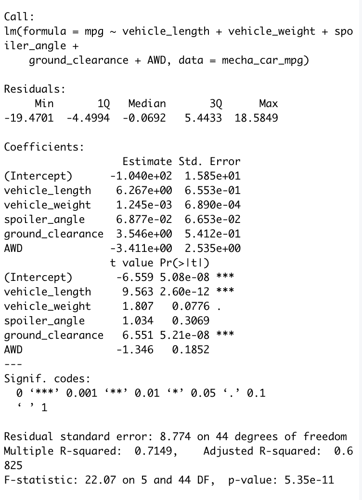
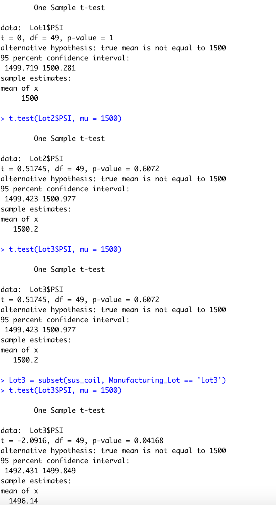
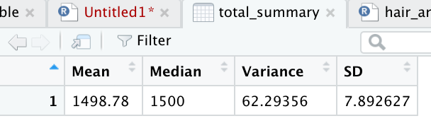

# MechaCar Statistical Analysis

## Purpose and Overview
The purpose of this project is to analyze and measure how difference factors can affect new MechaCar prototypes and to compare vehicle performance based on these measurements. Several of the factors being compared include weight, length, spoiler angle, ground clearance, AWD capabilities, MPG, and PSI.

## Linear Regression to Predict MPG

1. The vehicle length and ground clearance variables provided a non-random amount of variance to the mpg values
2. The slope is not considered to be zero because the p-value is so small and we can easily reject the null hypothesis
3. The linear model does a good job predicting mpg due to the adjusted R-squared being not too far off from the Multiple R-squared

## T-test on Suspension Coils

Conducting a t-test, we find the p-values of the three lots

• Lot 1 has a p-value of 1, higher than the significance level of 0.05. Because of this, we fail to reject the null hypothesis.

• Lot 2 has a p-value of 0.6072, and so because of this, we fail to reject the null hypothesis

• Lot 3 has a p-value of 0.04168. Because this value is lower than the significance level of 0.05, we can reject the null hypothesis.

## Summary Statistics on Suspension Coils

From the results we can see that overall, the manufacturing data meets the requirement that suspension coils must not exceed 100 pounds per square inch. However, when separated into 3 lots, the first and second lots show little variance; however, the third lot's variance far exceeds the limit.

## Study Design: MechaCar vs Competition

Another statistical test that we can employ to compare MechaCar vehicles against those of other manufacturers is comparing the maintenance cost of each company's vehicles.

• For this test, we can test for long term cost of maintenance over a span of 5 years

• The null hypothesis is that there is no difference in maintenance cost between MechaCar vehicles and those of other companies. The alternative hypothesis is that there is a difference.

• For this test, we would use a linear regression line similar to the one used in this test.

• The data for this test would include vehicle weight, vehicle length, and mpg.
